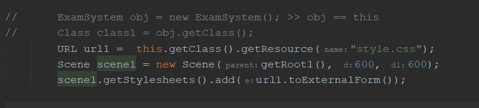
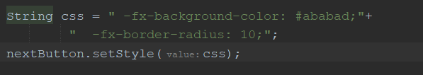
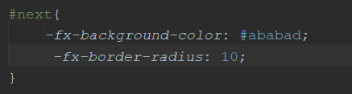

# java project Notes

## Files
### 1. ExamSystem :
- 

here this code is applied in order to link the scene to the css file , 
{this} in line four represent the object of the class ,note* : it can be replaced by {obj}   ,

- 

>>>>
Fig2. code is just an alternative to Fig1. code ,but in an external css file 

- switch scenes 
- get roots from other classes
---

### 2. quizCSVData :

- getting  data from CSV file & assigninng them to attributes
- generate random question
- **NOTE** : location of file should be changed to the location of the file on ur device

---

### 3. Questions :
- inherit data from quizCSVData and show them 
- return root
---

